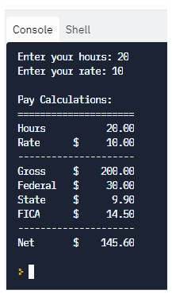

## Chapter 3 Practice - Decisions
### Notes:
- 🔥 **DO NOT make any changes to the `.devcontainer` folder or any files in it** 🔥  
- These are needed to set up your VS Code environment
---

### Instructions:
- Launch in Codespace
- The first part of the video you will be working in the console.
- The video then finishes in the **`main.py`**
- ***NOTE:  The second half of the video was done in a different editor, but the code will still work in Codespace. Just make sure you're working along in the `main.py`***
- Open the YouTube video and follow along:
> - **[YouTube Python Decisions Practice](https://youtu.be/CT8V98x9brE)**.  
- Be sure to copy/paste your practice from the console to the **`consoleoutput.txt`** file
- After following along with the editor practice, run your code to make sure it works correctly. See samples below:
> - No OT:
   > - 
> - With OT:
   > - 
---
### Committing and synching your changes:
- Commit changes as you go, even if you are not done, so that you don't lose your changes
- You must include a message with every commit
- When you are done with your code, your final commit message should say "Ready to grade"
---
### Submitting your assignment
- Open the assignment in Canvas
- Copy the URL for your repo and paste the link in the Canvas assignment as the answer to Question #1
- Answer the other questions
- On the last question, take a screenshot of your output and paste into the Canvas assignment
---

### Resources:
- **[Python Relational and Logical Operators](https://www.w3schools.com/python/python_operators.asp)**
- **[Python Conditional Statements](https://www.w3schools.com/python/python_conditions.asp)**
